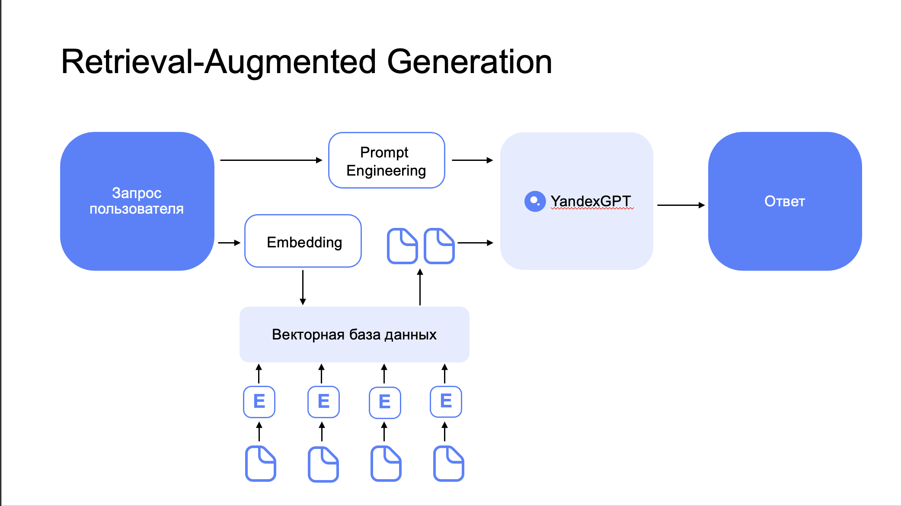

# Retrieval-Augmented Generation на базе сервисов Yandex Cloud

Языковая модель YandexGPT может использоваться для реализации сценариев ответа на вопросы по документации, набору регулирующих документов, базе знаний и т.д. Для того, чтобы модель опиралась на конкретный корпус документов, а не только на те данные, на которых она обучалась, рекомендуется использовать подход Retrieval-Augmented Generation.

## Как выглядит сценарий работы?:
1. База знаний (набор документов) разбивается на фрагменты, которые переводятся в векторное представление (embedding) с помощью YandexGPT и сохраняются в векторную базу данных. Примерами таких баз данных являются OpenSearch, ChromaDB, LanceDB и т.д.
1. Пользователь отправляет свой запрос к системе.
1. Запрос переводится в векторное представление с помощью модели YandexGPT. 
1. В векторной базе данных происходит поиск фрагментов наиболее близких к запросу пользователя. В зависимости от размера фрагментов выбирается топ-n наиболее релевантных документов.
1. Полученные документы, запрос пользователя и постановка задачи (промпт) передаются YandexGPT, которая генерирует финальный ответ, который возвращается пользователю. 

В данном руководстве для реализации описанного сценария будут использоваться следующие сервисы Yandex Cloud.
1. [YandexGPT](https://cloud.yandex.ru/docs/yandexgpt/) - большая языковая модель для построения embedding-ов по документам и ответов на вопросы.
1. [Yandex Managed Service for OpenSearch](https://cloud.yandex.ru/docs/managed-opensearch/) - Сервис для управления кластерами OpenSearch, который будет использоваться для хранения пар фрагментов документов и векторных представлений этих фрагментов.
1. [Yandex Object Storage](https://cloud.yandex.ru/docs/storage/) - Объектное хранилище, в котором изначально хранятся файлы с базой знаний. 
1. [Yandex DataSphere](https://cloud.yandex.ru/docs/datasphere/) - Cервис для обучения ML-моделей и среда разработки на Python для взаимодействия с YandexGPT и OpenSearch.

Работа с векторной БД и языковой моделью YandexGPT будет осуществляться с помощью популярного фреймворка с открытым исходным кодом [LangChain](https://www.langchain.com/). 

Подробные комментарии по работе с компонентами содержатся в файлах проекта, которые рекомендуется открыть в [Yandex DataSphere](https://cloud.yandex.ru/services/datasphere).

## Пошаговая инструкция

1. Необходимо перейти в сервис [OpenSearch](https://cloud.yandex.ru/services/managed-opensearch) и создать кластер по [инструкции](https://cloud.yandex.ru/docs/managed-opensearch/operations/cluster-create). Необходимо создать группу виртуальных хостов OpenSearch и группу виртуальных хостов Dashboards. Важно, чтобы кластер OpenSearch, Object Storage и DataSphere находились в одной подсети, например, 
default-ru-central1-a.
1. Перейдите в сервис [Yandex Object Storage](https://cloud.yandex.ru/docs/storage/), создайте новый бакет и загрузите в него документы, по которым будет необходимо отвечать на вопросы.  
1. Перейдите в сервис [Yandex DataSphere](https://cloud.yandex.ru/services/datasphere) и создайте в нем [сообщество](https://cloud.yandex.ru/docs/datasphere/operations/community/create) и [проект](https://cloud.yandex.ru/docs/datasphere/operations/projects/create), в котором можно будет запускать код на Python. 
1. Создайте [коннектор](https://cloud.yandex.ru/docs/datasphere/operations/data/s3-connectors) к Object Storage S3 в проекте DataSphere. Активируйте коннектор для работы с ним JupyterLab. 
1. В созданном проекте необходимо перейти во вкладку "Настройки" и указать:
- `Каталог по умолчанию`: каталог, в котором созданы сервисы Yandex Managed Service for OpenSearch и YandexGPT.
- `Сервисный аккаунт`: [сервисный аккаунт](https://cloud.yandex.ru/docs/iam/quickstart-sa), который позволит обращаться к другим сервисам из проекта DataSphere. Важно, что сервисному аккаунту должны быть назначены роли *ai.languageModels.user* для доступа к модели YandexGPT, *managed-opensearch.admin* для работы с OpenSearch и *vpc.user*.
- `Подсеть`: укажите подсеть, в которой находятся сервисы OpenSearch и YandexGPT.
1. Откройте проект в JupyterLab и склонируйте данный репозиторий с помощью [Git](https://cloud.yandex.ru/docs/datasphere/operations/projects/work-with-git). При запуске рекомендуем использовать режим Dedicated. 
1. Откройте в проекте ноутбук [YandexGPT_OpenSearch.ipynb](YandexGPT_OpenSearch.ipynb) и выполните все ячейки кода.

## Основные шаги в ноутбуке YandexGPT_OpenSearch
1. Документы из объектного хранилища разбиваются на небольшие фрагменты размером `chunk_size`. Размер `chunk_size` нужно выбирать исходя из нескольких показателей:
    * Допустимая длина контекста для эмбеддинг-модели. Yandex GPT Embeddings допускают 2048 токенов.
    * Допустимый размер окна контекста большой языковой модели. Если мы хотим использовать в запросе top 3 результатов поиска, то 3*chunk_size+prompt_size+response_size должно не превышать длины контекста модели.
1. Далее мы генерируем векторные эмбеддинги по фрагментам текста с помощью Yandex GPT Embedding API. Адаптер для работы с embeddings и моделью YandexGPT доступен в файле [YaGPT.py](YaGPT.py).
1. Добавляем полученные вектора в OpenSearch.
1. Тестируем извлечение релевантных фрагментов по запросу.
1. Собираем цепочку для Retrieval-Augmented Generation и проверяем её работу.
